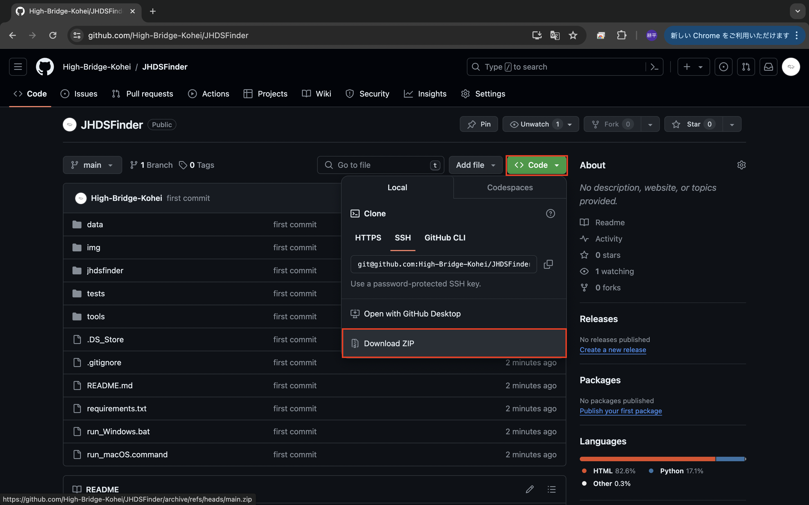

## JHDSFinder (Japanese High Dividend Stocks Finder)
日本の優良高配当株を見つけるためのGUIツールです。[リベラルアーツ大学の高配当株投資方針](https://liberaluni.com/stock-tool)に基づいています。


### GUIツール起動手順
WindowsとmacOSでの動作確認ができています。GUIツール起動の手順は以下です。
run_Windows.bat (もしくはrun_macOS.command) の実行時に、環境構築が完了されていない場合は、MinicondaのインストールとPythonライブラリのインストールを行います。(3分程度かかります) 初回実行時以外は、GUIツールの起動のみが実行されます。

1. **プログラムのダウンロード**
   [Github](https://github.com/High-Bridge-Kohei/JHDSFinder)からZipファイルでダウンロードすることができます。ダウンロードしたzipファイルを解凍してください。

2. **GUIツール起動プログラムの実行**
   **Windowsの場合**
   run_Windows.batのファイルをダブルクリックしてください。PCによって、そのままプログラムの実行ができる場合とできない場合があります。できない場合はコマンドプロンプトは起動するので、以下のコマンドを入力し実行してください。
   ```
   call run_Windows.bat
   ```
   **Macの場合**
   最初にファイルの実行権限を与えるために、ターミナルを起動し、以下のコマンドを実行してください。「chmod u+x 」を入力した後、run_macOS.commandのファイルをターミナルへドラック&ドロップすることで、コマンドを入力できます。
   ```
   chmod u+x <run_macOS.commandのファイルのへのパス>
   ```
   ターミナルを閉じ、run_macOS.commandをダブルクリックして、プログラムを実行してください。

### 注意事項
配当利回り等の企業情報が、Yahoo!ファイナンスなどの他のサイトと異なる場合があります。理由は以下です。

#### 1. 株価の情報が古い
ツール操作の利便性や他サイト免責事項の制約を考慮して、[無尽蔵](https://mujinzou.com/)から現在の株価の情報を取得しています。リアルタイムの株価ではなく、1日前の終値から株価を取得しているため、他のサイトと乖離が生じます。

#### 2. 業績の情報が古い
[IR Bank](https://irbank.net/download)の企業業績のデータを取得しています。企業情報の算出例として、以下に配当利回りの算出式を記載します。IR Bankの情報は1年毎にまとめられているため、直近の1株配当の実績が最新ではない場合があり、他のサイトと乖離が生じます。
```
<配当利回り> = <直近の1株配当の実績> / <現在の株価> * 100
```

#### 乖離が大きかった例
アイ・アールジャパンホールディングスは、GUIの検索結果では配当利回りが9.32%と算出されていますが、Yahoo!ファイナンスでは配当利回り2.47%です。
<div style="display: flex;">
    
    
</div>


アイ・アールジャパンホールディングスは2023年の1株あたりの配当は113円でしたが、2024年3月の1株配当が15円であると[公表](https://www.irjapan.jp/ir_info/stock/premium.html)しています。Yahoo!ファイナンスでは、公表された情報から年間での1株配当は30円であると推定し、配当利回りを算出しています。この例のように最新のデータで情報が異なる場合は乖離が生じるので、Yahoo!ファイナンスで確認できるようにリンクを設けています。<br>


### TODO
- データアップデートする際のポップアップ画面表示
- 詳細設定によるスクリーニング機能の追加
- LLMによるAI診断機能の追加