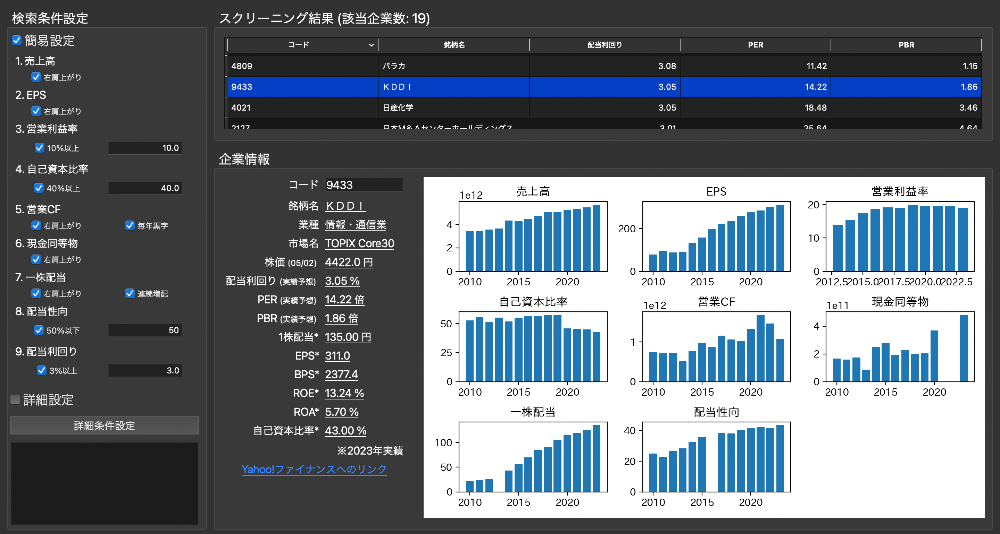
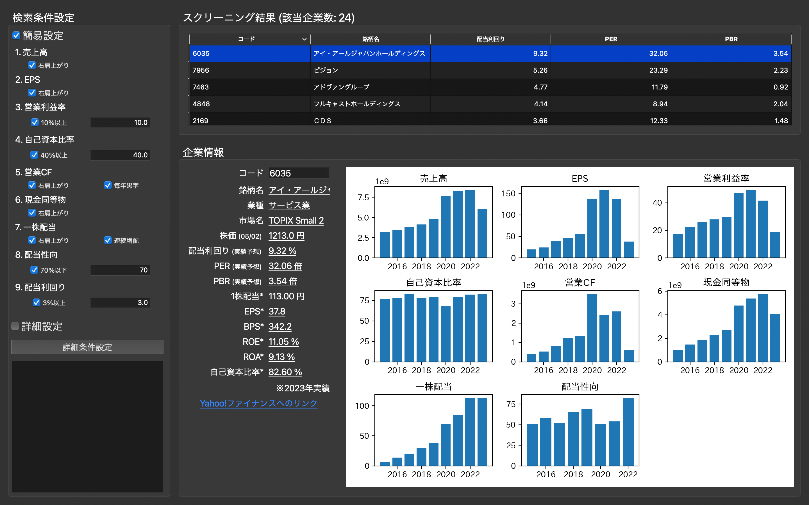
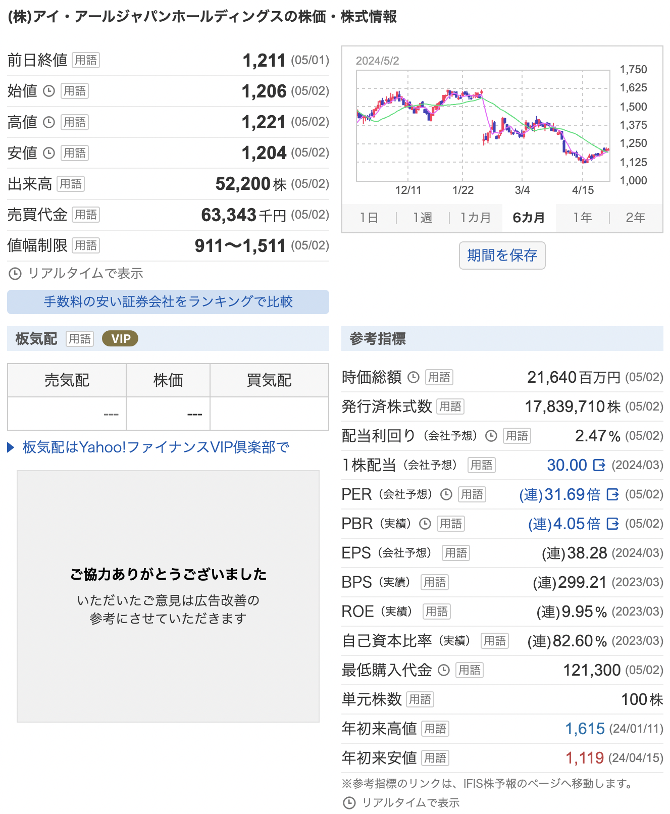
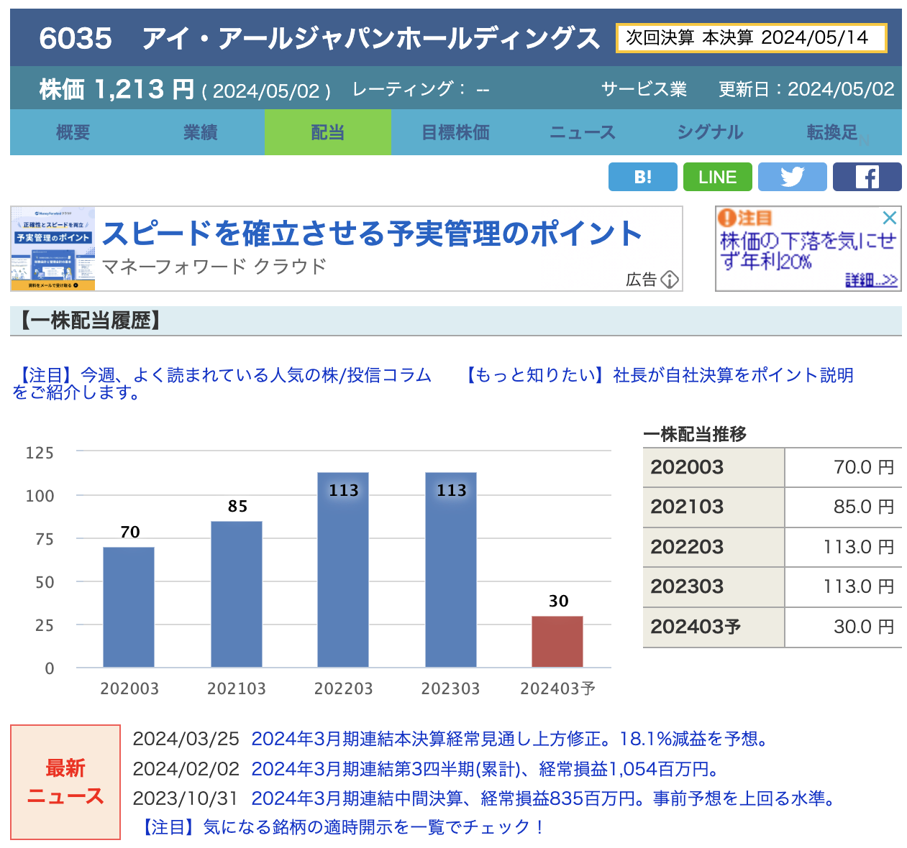

## JHDSFinder (Japanese High Dividend Stocks Finder)
日本の優良高配当株を見つけるためのGUIツールです。[リベラルアーツ大学の高配当株投資方針](https://liberaluni.com/stock-tool)に基づいています。



### 環境構築
WindowsとmacOSでの動作確認ができています。環境構築の手順は以下です。

1. **プログラムのダウンロード**
   [Github]()からZipファイルでダウンロードすることができます。ダウンロードしたzipファイルを解凍してください。
2. **GUIツール起動プログラムの実行**
   Windowsの場合はrun_Windows.bat、macOSの場合はrun_macOS.commandを実行してください。ファイルのダブルクリックで実行ができない場合は、以下の手順で実行してください。
   1. コマンドプロンプト(Windows)もしくはターミナル(macOS)を起動する。
   2. 以下コマンドにより、ダウンロードしたrun_Windows.batがあるフォルダのパスにディレクトリを移動する。
      ```
      cd <JHDSFinderのパス>
      ```
   3. 以下コマンドでファイルを実行する。
      Windowsの場合
      ```
      call run_Windows.bat
      ```
      macOSの場合
      ```
      source run_macOS.command
      ```

run_Windows.bat (もしくはrun_macOS.command) の実行時に、環境構築が完了されていない場合は、MinicondaのインストールとPythonライブラリのインストールを行います。初回実行時以外は、GUIツールの起動のみが実行されます。

### 注意事項
配当利回り等の企業情報が、Yahoo!ファイナンスなどの他のサイトと異なる場合があります。理由は以下です。

#### 1. 株価の情報が古い
ツール操作の利便性や他サイト免責事項の制約を考慮して、[無尽蔵](https://mujinzou.com/)から現在の株価の情報を取得しています。リアルタイムの株価ではなく、1日前の終値から株価を取得しているため、他のサイトと乖離が生じます。

#### 2. 業績の情報が古い
[IR Bank](https://irbank.net/download)の企業業績のデータを取得しています。企業情報の算出例として、以下に配当利回りの算出式を記載します。IR Bankの情報は1年毎にまとめられているため、直近の1株配当の実績が最新ではない場合があり、他のサイトと乖離が生じます。
```
<配当利回り> = <直近の1株配当の実績> / <現在の株価> * 100
```

#### 乖離が大きかった例
アイ・アールジャパンホールディングスはGUIの検索結果では、配当利回りが9.32%と算出されていますが、Yahoo!ファイナンスでは配当利回り2.47%です。
<div style="display: flex;">
    
    
</div>


おそらくYahoo!ファイナンスでは、アイ・アールジャパンホールディングスの2024年3月の1株配当が15円であると[公表](https://www.irjapan.jp/ir_info/stock/premium.html)されているのを反映し、年間での1株配当は30円であると推定し、配当利回りを算出しています。


### TODO
- データアップデートする際のポップアップ画面表示
- 詳細設定によるスクリーニング機能の追加
- ChatGPTによるAI診断機能の追加